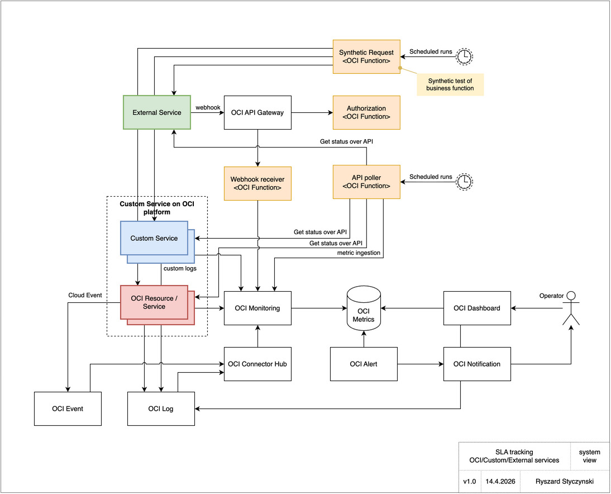
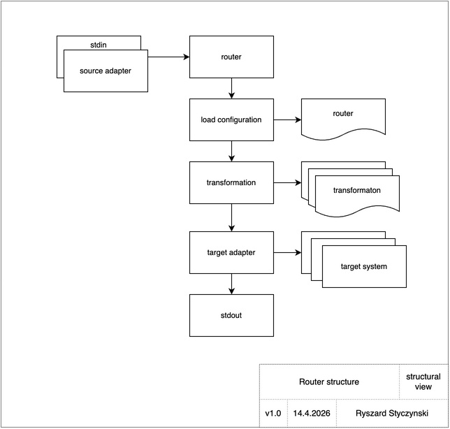
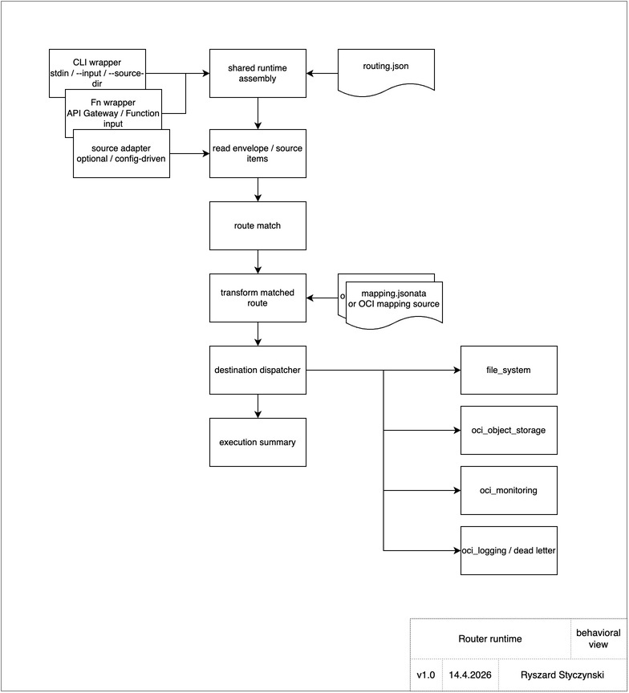

# SLI Tracker Manual

`SLI_tracker` is a framework for collecting, routing, storing, and evaluating Service Level Indicator data on Oracle Cloud Infrastructure. It provides tools and techniques to push service level indicators to OCI Monitoring, OCI Logging, and OCI Object Storage.

The same framework can be used beyond the GitHub Actions example implemented in this repository. The current repository is one concrete system built with these techniques, but the same pattern can be extended to other SLI sources, other telemetry domains, and other kinds of status or health information.

The framework can accept notifications from external systems, receive OCI-native events, and pull data from exposed service endpoints. In all of these cases it applies the same core flow: collect data, normalize it, route it, store it, and evaluate it.

The system model is shown below.

<p align="center"></p>

The editable source is [`model/model.drawio`](../model/model.drawio).

## Table of Contents

- [SLI Tracker Manual](#sli-tracker-manual)
  - [Table of Contents](#table-of-contents)
  - [1. Project Overview](#1-project-overview)
  - [2. Motivating Story and Mental Model](#2-motivating-story-and-mental-model)
    - [2.1 Start with a Real `workflow_run` Event](#21-start-with-a-real-workflow_run-event)
    - [2.2 Why Transformation Exists](#22-why-transformation-exists)
    - [2.3 Why the Router Exists](#23-why-the-router-exists)
  - [3. OCI Injection Examples](#3-oci-injection-examples)
    - [3.0 Prerequisites: OCI Resources](#30-prerequisites-oci-resources)
      - [Required OCI access](#required-oci-access)
      - [Path A — Create resources with `ensure_oci_resources.sh`](#path-a--create-resources-with-ensure_oci_resourcessh)
      - [Path B — Adopt existing OCI resources](#path-b--adopt-existing-oci-resources)
      - [Sync OCIDs to GitHub repository variables](#sync-ocids-to-github-repository-variables)
    - [3.1 Inject Log into OCI Logging](#31-inject-log-into-oci-logging)
    - [3.2 Inject Failure Log Message](#32-inject-failure-log-message)
    - [3.3 Query That Log Category Back and Compute Message-Level SLI](#33-query-that-log-category-back-and-compute-message-level-sli)
    - [3.4 Inject the Computed SLI as One Derived OCI Metric](#34-inject-the-computed-sli-as-one-derived-oci-metric)
    - [3.5 Search for metric data](#35-search-for-metric-data)
  - [4. Workflow data injection tools Hands-On](#4-workflow-data-injection-tools-hands-on)
    - [4.1 OCI authentication](#41-oci-authentication)
      - [4.1.1. Install OCI CLI locally](#411-install-oci-cli-locally)
      - [4.1.2. Create or refresh `SLI_TEST` with a browser-authenticated session](#412-create-or-refresh-sli_test-with-a-browser-authenticated-session)
      - [4.1.3. Understand what workflows do with that secret](#413-understand-what-workflows-do-with-that-secret)
    - [4.2 GitHub Actions SLI metric emitter](#42-github-actions-sli-metric-emitter)
    - [4.3 curl](#43-curl)
    - [4.4 js](#44-js)
    - [4.5 OCI side data view](#45-oci-side-data-view)
    - [4.6 Model Workflow Library](#46-model-workflow-library)
  - [5. Router and Ingest Hands-On](#5-router-and-ingest-hands-on)
    - [5.1 Key Concepts](#51-key-concepts)
    - [5.2 Transform a Document with JSONata](#52-transform-a-document-with-jsonata)
      - [Inline expression from stdin](#inline-expression-from-stdin)
      - [Transform with a real project mapping](#transform-with-a-real-project-mapping)
    - [5.3 Route One Envelope to a File](#53-route-one-envelope-to-a-file)
      - [The mapping](#the-mapping)
      - [The route](#the-route)
      - [The envelope](#the-envelope)
      - [Route from stdin](#route-from-stdin)
      - [Route from a file](#route-from-a-file)
      - [Adapter label and write location](#adapter-label-and-write-location)
    - [5.4 Route a GitHub Webhook with a Real Mapping](#54-route-a-github-webhook-with-a-real-mapping)
    - [5.5 Fan-Out One Envelope to Two Destinations](#55-fan-out-one-envelope-to-two-destinations)
      - [The fixture](#the-fixture)
      - [The mappings](#the-mappings)
      - [The routing](#the-routing)
      - [Fan-out from stdin](#fan-out-from-stdin)
    - [5.6 Batch Route a Source Directory](#56-batch-route-a-source-directory)
      - [The source envelopes](#the-source-envelopes)
      - [Batch mappings](#batch-mappings)
      - [Batch routing](#batch-routing)
      - [Run the batch](#run-the-batch)
      - [Inspect the output](#inspect-the-output)
    - [5.7 Route with Routing Definition and Mappings from OCI Object Storage](#57-route-with-routing-definition-and-mappings-from-oci-object-storage)
      - [Create the bucket](#create-the-bucket)
      - [Upload the routing definition to the bucket](#upload-the-routing-definition-to-the-bucket)
      - [Upload the mapping to the bucket](#upload-the-mapping-to-the-bucket)
      - [Run the CLI with bucket routing](#run-the-cli-with-bucket-routing)
      - [Load both routing definition and mappings from the bucket](#load-both-routing-definition-and-mappings-from-the-bucket)
    - [5.8 Deploy the Public Router Function](#58-deploy-the-public-router-function)
      - [Prerequisites](#prerequisites)
      - [Configure](#configure)
      - [Deploy](#deploy)
    - [Remove any data from previous runs](#remove-any-data-from-previous-runs)
      - [Read the endpoint](#read-the-endpoint)
    - [5.9 Send a Webhook to the Deployed Function](#59-send-a-webhook-to-the-deployed-function)
      - [Generic POST (no GitHub header)](#generic-post-no-github-header)
      - [POST a GitHub ping event](#post-a-github-ping-event)
      - [POST a completed workflow\_run event](#post-a-completed-workflow_run-event)
    - [5.10 Verify Fan-Out to OCI Monitoring and Logging](#510-verify-fan-out-to-oci-monitoring-and-logging)
    - [5.11 OCI Authentication Profiles](#511-oci-authentication-profiles)
      - [The Profile Setup Tool](#the-profile-setup-tool)
        - [Mode 1 — Session (browser-authenticated token)](#mode-1--session-browser-authenticated-token)
        - [Mode 2 — Config profile (API-key based)](#mode-2--config-profile-api-key-based)
      - [Profile Restoration on CI Runners](#profile-restoration-on-ci-runners)
    - [5.12 Teardown](#512-teardown)
  - [6. SLI Calculation](#6-sli-calculation)
  - [7. Additional Tools](#7-additional-tools)
    - [7.1 Synthetic Event Generator](#71-synthetic-event-generator)
    - [7.2 Monitoring Metric Catalog](#72-monitoring-metric-catalog)
  - [8. Test Suites](#8-test-suites)

## 1. Project Overview

`SLI_tracker` is an general purpose OCI-based Service LEvel Indicator (SLI) collection and processing framework. In this repository, the main exemplar use case is CI/CD telemetry built around GitHub Actions, but the architecture is intentionally broader than one pipeline domain.

At a high level, the system does five things:

1. It emits structured SLI events from GitHub Actions workflows.
2. It receives notifications and events from external systems and OCI-native services.
3. It can query exposed service endpoints to collect status data.
4. It transforms and routes JSON payloads using JSONata mappings.
5. It stores telemetry in OCI services such as Logging, Monitoring, and Object Storage, then computes derived SLI values from that telemetry.

The repository evolved in stages:

1. Initial GitHub Actions instrumentation and OCI Logging emission.
2. Optional OCI Monitoring metric emission.
3. Local and workflow-based testing around emission.
4. A generic JSON routing and transformation layer.
5. OCI Function based public ingest and fan-out delivery.
6. Component-scoped testing and RUP-managed delivery process.

## 2. Motivating Story and Mental Model

The best way to understand this repository is to start with one concrete event and follow it until it becomes useful operational data.

### 2.1 Start with a Real `workflow_run` Event

GitHub can send a `workflow_run` webhook when a workflow finishes. That event is rich, but it is not yet in a form that operators want to query, route, alert on, or compute ratios from.

For example, a real payload contains fields in a shape like this:

```json
{
  "action": "completed",
  "workflow_run": {
    "id": 123456789,
    "name": "model-push",
    "conclusion": "success",
    "head_branch": "main",
    "head_sha": "abc123"
  },
  "repository": {
    "full_name": "owner/repo"
  }
}
```

That message already has value. It tells us something happened, where it happened, and whether it succeeded. But it is still source-shaped data. It reflects GitHub's event model, not the model that OCI Logging, OCI Monitoring, dashboards, alerts, or downstream systems want to consume.

### 2.2 Why Transformation Exists

Transformation exists because raw webhook payloads are too source-specific. We usually want a smaller, cleaner contract such as:

- one normalized event for audit and troubleshooting
- one numeric signal for Monitoring
- one destination-specific object for storage or later processing

This is why the project uses JSONata mappings. Instead of hardcoding every source-to-target conversion in application code, the operator can define how a `workflow_run` becomes:

- a searchable log entry
- a metric datapoint
- a normalized router envelope

Transformation is the point where the system stops being "GitHub-specific JSON handling" and becomes a reusable telemetry platform.

### 2.3 Why the Router Exists

Transformation alone is not enough. Once data is normalized, someone still has to decide where it goes.

That is the router's job. The router lets the operator define:

- which messages match which routes
- which mapping should run for each route
- whether delivery is exclusive or fanout
- which destination should receive the result

This matters because the same `workflow_run` can be valuable in more than one place. One route may send an audit-friendly document to OCI Logging. Another may produce a metric-friendly document for OCI Monitoring. A third may archive the same event in Object Storage. The router turns one incoming message into an operator-controlled delivery policy.

## 3. OCI Injection Examples

Before going deeper into the architecture, it helps to see the two basic sink types directly:

- OCI Monitoring for compact numeric signals
- OCI Logging for searchable event records

> **Profile note:** The examples in this section use the local `DEFAULT` OCI profile on purpose. At this stage the reader only needs one working authenticated profile to see data arrive in OCI. The repository-specific `SLI_TEST` profile is introduced later in [Authenticate SLI_TEST](#authenticate-sli_test) and described in more detail in §5.6.

### 3.0 Prerequisites: OCI Resources

#### Required OCI access

> **Note:** This project is in construction phase. The access policy below grants broad privileges intentionally — least-privilege hardening is deferred to a future production readiness sprint.

Tenancy-level administrator access is preferred and simplifies setup. Compartment-level access works too, but the operator must ensure the profile has the following permissions on the target compartment:

| OCI service | Required permission |
| ----------- | ------------------- |
| Compartments | `COMPARTMENT_INSPECT` |
| Logging (log groups + logs) | `LOG_GROUP_CREATE`, `LOG_GROUP_INSPECT`, `LOG_CREATE`, `LOG_INSPECT` |
| Logging ingestion | `LOG_PUSH_DATA` |
| Monitoring (metric post) | `METRIC_SUBMIT` |
| Object Storage | `OBJECT_CREATE`, `OBJECT_READ`, `BUCKET_CREATE`, `BUCKET_INSPECT` |
| Functions + API Gateway | `FN_FUNCTION_CREATE`, `FN_FUNCTION_INVOKE`, `API_GATEWAY_CREATE` |

The simplest policy statement for a **tenancy administrator**:

```text
Allow group <your-group> to manage all-resources in tenancy
```

For **compartment-level** access, scope the same statement to the compartment:

```text
Allow group <your-group> to manage all-resources in compartment <compartment-name>
```

These policies are set in the OCI Console under **Identity → Policies** or via OCI CLI.

Before running the examples below, you need three OCIDs in your shell environment: `COMPARTMENT_OCID`, `LOG_ID`, and `LOG_GROUP_ID`. Choose one path.

#### Path A — Create resources with `ensure_oci_resources.sh`

If you do not yet have an OCI log set up for this project, load the helper script first, then call the specific function that creates or adopts the compartment, log group, and log. The script itself is source-only: `source tools/ensure_oci_resources.sh` just loads function definitions into the current shell. The actual OCI work starts when you call `ensure_sli_log_resources ...`. That function is idempotent, so it is safe to re-run.

```bash
source tools/ensure_oci_resources.sh

export NAME_PREFIX="sli_quickstart"
export SLI_OCI_LOG_URI="/SLI_tracker/sli-events/github-actions"

ensure_sli_log_resources "$(pwd)" DEFAULT "$NAME_PREFIX" "$SLI_OCI_LOG_URI"
export LOG_ID="$SLI_LOG_OCID"
export LOG_GROUP_ID="$LOG_GROUP_OCID"
```

State is written to `./state-${NAME_PREFIX}.json`. You can read OCIDs from it any time:

```bash
jq '{compartment: .compartment.ocid, log_group: .log_group.ocid, log: .log.ocid}' state-sli_quickstart.json
```

#### Path B — Adopt existing OCI resources

`ensure_sli_log_resources` is idempotent — it inspects existing OCI resources by name and adopts them if they already exist, creating only what is missing. This is the reason the project uses `oci_scaffold` helpers instead of Terraform: the same script works on a fresh account and on an account where those resources were created by hand or by a previous run.

If you prefer to skip the helper entirely and point at OCIDs you already know, export them directly:

```bash
export COMPARTMENT_OCID="ocid1.compartment.oc1..<your-compartment-ocid>"
export LOG_GROUP_ID="ocid1.loggroup.oc1..<your-log-group-ocid>"
export LOG_ID="ocid1.log.oc1..<your-log-ocid>"
```

#### Sync OCIDs to GitHub repository variables

GitHub workflows read these OCIDs from repository variables. Once the OCIDs are in your shell, push them to the repository — this step is required for any workflow in this project to reach OCI:

```bash
repo=$(gh repo view --json nameWithOwner -q .nameWithOwner)
gh variable set SLI_OCI_LOG_ID          --body "$LOG_ID"           -R "$repo"
gh variable set SLI_OCI_COMPARTMENT_ID  --body "$COMPARTMENT_OCID" -R "$repo"
gh variable set SLI_OCI_LOG_GROUP_ID    --body "$LOG_GROUP_ID"     -R "$repo"
```

### 3.1 Inject Log into OCI Logging

Having infrastructure ready, we can inject log entry into OCI logging subsystem. Logging is one of techniques used by SLI tracker to store descriptive events inside of the OCI.

The payload is intentionally small and easy to recognize when you query the log later.

```json
{
  "defaultlogentrytime": "2024-01-19T15:23:45Z",
  "source": "manual/oci-cli",
  "type": "sli-event",
  "entries": [
    {
      "id": "2024-01-19T15:23:45Z-manual",
      "time": "2024-01-19T15:23:45Z",
      "data": "{\"source\":\"manual\",\"path\":\"oci-cli\",\"outcome\":\"success\",\"timestamp\":\"2024-01-19T15:23:45Z\"}"
    }
  ]
}
```

Below bash code appends above JSON log entry to the configured OCI log.

```bash
# Requires: LOG_ID exported in §3.0
TS="$(date -u +"%Y-%m-%dT%H:%M:%SZ")"
export OCI_CLI_PROFILE=DEFAULT

LOG_BATCHES="$(jq -nc \
  --arg ts "$TS" \
  '[{
    defaultlogentrytime: $ts,
    source: "manual/oci-cli",
    type: "sli-event",
    entries: [{
      id: ($ts + "-manual"),
      time: $ts,
      data: ({
        source: "manual",
        path: "oci-cli",
        outcome: "success",
        timestamp: $ts
      } | tostring)
    }]
  }]')"

oci logging-ingestion put-logs \
  --log-id "$LOG_ID" \
  --specversion "1.0" \
  --log-entry-batches "$LOG_BATCHES"
```

### 3.2 Inject Failure Log Message

To demonstrate SLI you will inject a failure event, keeping the same shape as the success payload above and change `outcome` to `"failure"`. Include an explicit failure reason so you can spot it easily in OCI Logging.

```bash
# Requires: LOG_ID exported in §3.0
TS="$(date -u +"%Y-%m-%dT%H:%M:%SZ")"
export OCI_CLI_PROFILE=DEFAULT

LOG_BATCHES="$(jq -nc \
  --arg ts "$TS" \
  '[{
    defaultlogentrytime: $ts,
    source: "manual/oci-cli",
    type: "sli-event",
    entries: [{
      id: ($ts + "-manual"),
      time: $ts,
      data: ({
        source: "manual",
        path: "oci-cli",
        outcome: "failure",
        timestamp: $ts
      } | tostring)
    }]
  }]')"

oci logging-ingestion put-logs \
  --log-id "$LOG_ID" \
  --specversion "1.0" \
  --log-entry-batches "$LOG_BATCHES"
```

This is the first point where the operator can see the whole idea working end to end. The CLI command is not just accepted locally; it creates a real searchable record in OCI Logging. Open the OCI Console, go to the log associated with this deployment, and inspect recent entries. Look for records where `source == "manual"` and `path == "oci-cli"` to confirm that the timestamp and payload match what you injected.

Once both `success` and `failure` entries are visible, you have validated the most basic ingestion path: a structured event left your shell, reached OCI, and became queryable operational data.

If you want to jump directly to the log in OCI Console, derive the region from the log OCID and open it. Be prepared to wait 30-60 seconds for data to appear in the log search console - it's the time needed to ingest the data.

```bash
REGION=$(echo "$LOG_ID" | cut -d. -f4)
open "https://cloud.oracle.com/logging/logs/${LOG_ID}/log-groups/${LOG_GROUP_ID}/explore-log?region=${REGION}"
```

### 3.3 Query That Log Category Back and Compute Message-Level SLI

For the manual CLI log examples above, a simple message-level SLI is `number of success messages / number of messages`. The category is identified by the payload fields `source=="manual"` and `path=="oci-cli"`. Wait around 60 seconds for log propagation, then search the last 30 minutes of data and compute the ratio.

```bash
# Requires: COMPARTMENT_OCID, LOG_ID, LOG_GROUP_ID exported in §3.0
export OCI_CLI_PROFILE=DEFAULT
TS_START="$(date -u -v-30M '+%Y-%m-%dT%H:%M:%SZ' 2>/dev/null || date -u --date='-30 min' '+%Y-%m-%dT%H:%M:%SZ')"
TS_END="$(date -u '+%Y-%m-%dT%H:%M:%SZ')"

EVENTS="$(
  oci logging-search search-logs \
    --search-query "search \"${COMPARTMENT_OCID}/${LOG_GROUP_ID}/${LOG_ID}\" | sort by datetime desc | limit 200" \
    --time-start "$TS_START" \
    --time-end "$TS_END" \
    --output json \
  | jq '.data.results'
)"

PARSED_EVENTS="$(
  printf '%s\n' "$EVENTS" \
    | jq '
        [
          .[]
          | .data.logContent.data
          | try (if type=="string" then fromjson else . end) catch empty
          | select(.source == "manual" and .path == "oci-cli")
        ]
      '
)"

TOTAL="$(jq -n --argjson events "$PARSED_EVENTS" '$events | length')"
SUCCESS="$(jq -n --argjson events "$PARSED_EVENTS" '$events | map(select(.outcome == "success")) | length')"
FAILURE="$(jq -n --argjson events "$PARSED_EVENTS" '$events | map(select(.outcome == "failure")) | length')"
SLI="$(jq -n --argjson success "$SUCCESS" --argjson total "$TOTAL" 'if $total == 0 then null else ($success / $total) end')"

jq -n \
  --argjson total "$TOTAL" \
  --argjson success "$SUCCESS" \
  --argjson failure "$FAILURE" \
  --argjson sli "$SLI" \
  '{total_messages: $total, success_messages: $success, failure_messages: $failure, sli: $sli}'
```

If you inserted one success message and one failure message into this category, the expected result is:

```json
{
  "total_messages": 2,
  "success_messages": 1,
  "failure_messages": 1,
  "sli": 0.5
}
```

### 3.4 Inject the Computed SLI as One Derived OCI Metric

After you compute `SLI` from the queried log stream, you can publish that ratio back to OCI Monitoring as a derived metric. Run this in the same shell as the previous snippet if you want to reuse the computed value. If `SLI` is not already set, this example falls back to `0.5` so the reader can still exercise the Monitoring path. In this example the metric carries the dimension `window="30min"` so the reader can see which aggregation window produced the value.

```bash
# Requires: COMPARTMENT_OCID exported in §3.0; optionally reuse SLI from §3.3
export OCI_CLI_PROFILE=DEFAULT
TS="$(date -u +"%Y-%m-%dT%H:%M:%SZ")"
SLI="${SLI:-0.5}"

OCI_REGION="$(
  oci os ns get --debug 2>&1 \
    | sed -n 's/.*Endpoint: https:\/\/objectstorage\.\([^.]*\)\..*/\1/p' \
    | head -1
)"
OCI_REALM_SUFFIX="$(
  oci os ns get --debug 2>&1 \
    | sed -n 's/.*Endpoint: https:\/\/objectstorage\.[^.]*\.\([^[:space:]]*\).*/\1/p' \
    | head -1
)"


OCI_MONITORING_ENDPOINT="https://telemetry-ingestion.${OCI_REGION}.${OCI_REALM_SUFFIX}"

SLI_METRIC_PAYLOAD="$(jq -nc \
  --arg compartment "$COMPARTMENT_OCID" \
  --arg ts "$TS" \
  --argjson sli "$SLI" \
  '[{
    compartmentId: $compartment,
    namespace: "sli_tracker_manual",
    name: "sli",
    dimensions: {
      source: "manual",
      path: "oci-cli",
      window: "30min"
    },
    datapoints: [{
      timestamp: $ts,
      value: $sli
    }]
  }]')"

oci monitoring metric-data post \
  --endpoint "$OCI_MONITORING_ENDPOINT" \
  --metric-data "$SLI_METRIC_PAYLOAD" \
  --batch-atomicity ATOMIC
```

This is the metric-side equivalent of the earlier Logging check. The command does not just return success locally; it creates real datapoints in OCI Monitoring that can later drive charts, queries, alarms, and derived SLI calculations. Open the OCI Console and go to Metric Explorer.

```bash
echo "Open OCI Metric Explorer: https://cloud.oracle.com/monitoring/explore?region=$OCI_REGION"
```

Select compartment `SLI_tracker`, namespace `sli_tracker_manual`, metric name `sli`, and press `Update chart`. You should see a single point near the right edge of the chart. Press `Show Data Table` to inspect the raw datapoint.

Once those datapoints are visible, you have validated the second half of the telemetry story: the same manual exercise can now produce both searchable event records in Logging and numeric signals in Monitoring.

### 3.5 Search for metric data

The project later computes SLI from Monitoring data over a sliding time window. The live implementation in [`tools/sli_compute_sli_metrics.js`](../tools/sli_compute_sli_metrics.js) uses Monitoring summary queries over a bounded interval, then derives `success / total` from the returned datapoints. Before going there, it is useful to query the just-inserted manual datapoints directly with OCI CLI and see that they are really present.

The example below searches the last 60 minutes for the metric series created in the previous step. It is the CLI equivalent of searching for the same series in OCI Metric Explorer.

```bash
# Requires: COMPARTMENT_OCID exported in §3.0
export OCI_CLI_PROFILE=DEFAULT
TS_START="$(date -u -v-60M '+%Y-%m-%dT%H:%M:%SZ' 2>/dev/null || date -u --date='-60 min' '+%Y-%m-%dT%H:%M:%SZ')"
TS_END="$(date -u '+%Y-%m-%dT%H:%M:%SZ')"

oci monitoring metric-data summarize-metrics-data \
  --compartment-id "$COMPARTMENT_OCID" \
  --namespace sli_tracker_manual \
  --start-time "$TS_START" \
  --end-time "$TS_END" \
  --resolution 1m \
  --query-text 'sli[1m].mean()' \
  --output json \
| jq '.data[]'
```

If the data is already visible, the query returns one or more streams with `aggregated-datapoints`. The timestamps should be close to the values you inserted manually. If you do not see anything yet, wait a short while and repeat the command, because Monitoring ingestion is not always immediate.

This is a simplified form of the same idea used later for sliding-window SLI computation. Here you only verify that the datapoints exist. Later, the project queries Monitoring over a larger rolling interval and aggregates those datapoints into one operational SLI value.

## 4. Workflow data injection tools Hands-On

Direct log and metric injection is conceptually simple, but it quickly becomes configuration-heavy. This project therefore provides several operator-facing entry points: local CLI examples, GitHub workflow examples, and reusable local GitHub Actions.

The next step after direct injection is automation. Incoming traffic such as GitHub webhooks cannot be handled manually, so the project also provides transformer and router components that can classify messages, reshape them, and forward them to the right destinations. Before getting there, the operator should first understand how workflow-based OCI authentication works.

### 4.1 OCI authentication

Before playing with workflow examples, prepare the project-specific OCI profile `SLI_TEST`. This is the profile name expected by the workflows in this repository. The recommended starting mode is a browser-authenticated session token, which is safer for operator-driven setup than distributing a long-lived API key.

The session-based setup has three moving parts:

- OCI CLI on the machine where you prepare the profile
- the local setup script that creates or refreshes `SLI_TEST`
- the workflow restore action that recreates that profile on GitHub runners

#### 4.1.1. Install OCI CLI locally

The profile setup script calls `oci session authenticate`, so your workstation needs a working OCI CLI first. Use regular Oracle documentation to install OCI CLI on your system; typically it's as easy as package installation.

#### 4.1.2. Create or refresh `SLI_TEST` with a browser-authenticated session

Run the operator-side setup script from the repository root:

```bash
.github/actions/oci-profile-setup/setup_oci_github_access.sh \
  --account-type session \
  --profile DEFAULT \
  --session-profile-name SLI_TEST \
  --repo "$(gh repo view --json nameWithOwner -q .nameWithOwner)"
```

What this does:

- starts `oci session authenticate`
- lets you log in through the browser
- creates a local session profile named `SLI_TEST`
- packs the needed `~/.oci/config` and `~/.oci/sessions/SLI_TEST` content
- uploads that payload to the GitHub secret `OCI_CONFIG_PAYLOAD`

This same command is also the refresh command. When the session token expires, run it again to replace the GitHub secret with a fresh session.

After it succeeds, verify locally:

```bash
oci iam region-subscription list --profile SLI_TEST --auth security_token | jq '.data[0]'
```

#### 4.1.3. Understand what workflows do with that secret

Workflows do not log in interactively. Instead, they restore and replay the profile you prepared earlier.

The usual pair of workflow steps is:

1. `install-oci-cli`
2. `oci-profile-setup`

Both are packaged in this repository as local GitHub Actions:

- [`.github/actions/install-oci-cli/action.yml`](../.github/actions/install-oci-cli/action.yml)
- [`.github/actions/oci-profile-setup/action.yml`](../.github/actions/oci-profile-setup/action.yml)

So workflows use them through `uses: ./.github/actions/...` rather than reimplementing shell logic inline.

`install-oci-cli`:

- installs OCI CLI on the GitHub runner
- adds `oci` to `PATH`
- is required for any workflow that uses the `oci-cli` backend

`oci-profile-setup`:

- reads the repository secret `OCI_CONFIG_PAYLOAD`
- restores `~/.oci/config` and session files on the runner
- exposes the resolved profile name to later workflow steps

Example workflow pattern:

```yaml
- name: Install OCI CLI
  uses: ./.github/actions/install-oci-cli

- name: Restore OCI profile
  id: oci_profile
  uses: ./.github/actions/oci-profile-setup
  with:
    oci_config_payload: ${{ secrets.OCI_CONFIG_PAYLOAD }}
    profile: SLI_TEST
```

Then later steps use:

- `profile: ${{ steps.oci_profile.outputs.profile || 'SLI_TEST' }}`

This is why the profile name matters. The packed profile name and the workflow restore profile must match.

Useful references:

- [`.github/actions/oci-profile-setup/setup_oci_github_access.sh`](../.github/actions/oci-profile-setup/setup_oci_github_access.sh)
- [`.github/actions/oci-profile-setup/README.md`](../.github/actions/oci-profile-setup/README.md)

### 4.2 GitHub Actions SLI metric emitter

Metric emitter supports:

- `cli`, regular OCI CLI build on top of python
- `curl` to talk directly over OCI APIs
- `js` to use the Oracle JS SDK

Those three workflow variants are:

- [`.github/workflows/model-emit.yml`](../.github/workflows/model-emit.yml)
- [`.github/workflows/model-emit-curl.yml`](../.github/workflows/model-emit-curl.yml)
- [`.github/workflows/model-emit-js.yml`](../.github/workflows/model-emit-js.yml)

Once `SLI_TEST` is authenticated and the secret is fresh, you can move to workflow examples and expect OCI-backed steps to work without additional local setup.

GitHub workflows call two actions:

- [`.github/actions/sli-event/action.yml`](../.github/actions/sli-event/action.yml) - that cover both `cli` and `curl`
- [`.github/actions/sli-event-js/action.yml`](../.github/actions/sli-event-js/action.yml) - utilizing native GitHub JavaScript support with `post` registration.

Make sure SLI_TEST session is authenticated and run the workflows.

```bash
.github/actions/oci-profile-setup/setup_oci_github_access.sh \
  --account-type session \
  --profile DEFAULT \
  --session-profile-name SLI_TEST \
  --repo "$(gh repo view --json nameWithOwner -q .nameWithOwner)"
```

Execute below snippet to get GitHub console workflow home, where you can trigger it.

```bash
repo="$(gh repo view --json nameWithOwner -q .nameWithOwner)"
echo "https://github.com/${repo}/actions/workflows/model-emit.yml"
```

Below code does the same from gh cli.

```bash
repo="$(gh repo view --json nameWithOwner -q .nameWithOwner)"
WORKFLOW_FILE=".github/workflows/model-emit.yml"

gh workflow run "$WORKFLOW_FILE" -R "$repo" \
-f simulate-failure=false

RUN_ID=$(gh run list -R "$repo" --workflow "$WORKFLOW_FILE" \
--limit 1 --json databaseId -q '.[0].databaseId')

gh run watch "$RUN_ID" -R "$repo"
```

After the workflow finishes, open the GitHub run page first and confirm that `Main step` and `SLI Report (oci)` both executed. Then open the OCI Logging URL and inspect the newest entries. You should see one event emitted by the workflow path rather than by the manual CLI examples from chapter 3. To observe the failure path, run the same command again with `-f simulate-failure=true` and compare the emitted outcome.

```bash
echo "Open GitHub run:"
echo "https://github.com/${repo}/actions/runs/${RUN_ID}"
```

### 4.3 curl

The `curl` workflow exercises the same emission contract, but without installing OCI CLI on the runner. It restores the same `SLI_TEST` profile and signs direct OCI API requests with the profile material.

```bash
repo="$(gh repo view --json nameWithOwner -q .nameWithOwner)"
WORKFLOW_FILE=".github/workflows/model-emit-curl.yml"

gh workflow run "$WORKFLOW_FILE" -R "$repo" \
  -f simulate-failure=false

RUN_ID="$(
  gh run list -R "$repo" --workflow "$WORKFLOW_FILE" \
    --limit 1 --json databaseId -q '.[0].databaseId'
)"

gh run watch "$RUN_ID" -R "$repo"

echo "Open GitHub run:"
echo "https://github.com/${repo}/actions/runs/${RUN_ID}"
```

After the workflow finishes, confirm that `Main step` and `SLI Report (curl)` both executed. This validates the direct OCI API backend.

### 4.4 js

The `js` workflow exercises the Oracle JavaScript SDK path. It uses the same OCI profile but reports through the JavaScript action variant registered with a GitHub `post` hook.

```bash
repo="$(gh repo view --json nameWithOwner -q .nameWithOwner)"
WORKFLOW_FILE=".github/workflows/model-emit-js.yml"

gh workflow run "$WORKFLOW_FILE" -R "$repo" \
  -f simulate-failure=false

RUN_ID="$(gh run list -R "$repo" --workflow "$WORKFLOW_FILE" \
--limit 1 --json databaseId -q '.[0].databaseId'
)"

gh run watch "$RUN_ID" -R "$repo"

echo "Open GitHub run:"
echo "https://github.com/${repo}/actions/runs/${RUN_ID}"
```

After the workflow finishes, confirm that `Main step` and `SLI Report (js)` both executed. This validates the JavaScript SDK backend.

### 4.5 OCI side data view

All three workflow variants now emit OCI log data and OCI Monitoring data in one step. The backend changes from `oci-cli` to `curl` to `js`, but the operator outcome is the same: one workflow run should produce both searchable log records and monitoring datapoints.

Open OCI Console to confirm that log entry was added.

```bash
LOG_ID="$(gh variable get SLI_OCI_LOG_ID -R "$repo")"
LOG_GROUP_ID="$(gh variable get SLI_OCI_LOG_GROUP_ID -R "$repo")"
OCI_REGION="$(echo "$LOG_ID" | cut -d. -f4)"

echo "Open OCI Logging console:"
echo "https://cloud.oracle.com/logging/logs/${LOG_ID}/log-groups/${LOG_GROUP_ID}/explore-log?region=${OCI_REGION}"
```

Finally open OCI Metric Explorer to see that monitoring metric is in place.

```bash
echo "Open OCI Metric Explorer:"
echo "https://cloud.oracle.com/monitoring/explore?region=${OCI_REGION}"
```

Note that URL invoke does not accept any parameters, and you need to select compartment `SLI_tracker`, namespace `sli_tracker_manual`, metric name `sli`, and press `Update chart`. You should see a single point near the right edge of the chart. Press `Show Data Table` to inspect the raw datapoint.

### 4.6 Model Workflow Library

The `model-*` files under `.github/workflows/` are a reference library of GitHub Actions patterns used by real production pipelines. Each file isolates one technique so it can be studied, tested, and copied without reading a complex real workflow. They are not application workflows; they are runnable examples that produce SLI events just like a production pipeline would.

| Workflow file | Pattern represented | Key technique |
| --- | --- | --- |
| [`model-call.yml`](../.github/workflows/model-call.yml) | External trigger | `workflow_dispatch` + `repository_dispatch` |
| [`model-reusable-main.yml`](../.github/workflows/model-reusable-main.yml) | Two-job + matrix | `workflow_call`, job `needs`, matrix over environments |
| [`model-reusable-sub.yml`](../.github/workflows/model-reusable-sub.yml) | Reusable sub-workflow | Step outputs, conditional steps, SLI event emission |
| [`model-pr.yml`](../.github/workflows/model-pr.yml) | PR trigger | `pull_request` event → delegates to reusable main |
| [`model-push.yml`](../.github/workflows/model-push.yml) | Push trigger | `push` event → programmatic `workflow_dispatch` |
| [`model-call-success.yml`](../.github/workflows/model-call-success.yml) | Forced success | Pre-canned call that always succeeds for SLI baseline |
| [`model-call-failure.yml`](../.github/workflows/model-call-failure.yml) | Forced failure | Pre-canned call that always fails for SLI alert testing |

Trigger `model-call.yml` from the CLI as a quick end-to-end smoke test:

```bash
repo="$(gh repo view --json nameWithOwner -q .nameWithOwner)"
gh workflow run ".github/workflows/model-call.yml" -R "$repo" \
  -f simulate-failure=false

RUN_ID="$(gh run list -R "$repo" --workflow "model-call.yml" \
  --limit 1 --json databaseId -q '.[0].databaseId')"

gh run watch "$RUN_ID" -R "$repo"
echo "https://github.com/${repo}/actions/runs/${RUN_ID}"
```

The run dispatches `model-call.yml` → `model-reusable-main.yml` → `model-reusable-sub.yml` and produces a complete two-level SLI emission trace in OCI Logging. Use `model-call-failure.yml` to inject a known-failure event for alarm and dashboard testing.

## 5. Router and Ingest Hands-On

This chapter walks through the router from the simplest possible local case to the deployed public ingest Function. Each section is runnable on its own and leaves a visible artifact you can inspect.

The diagram below shows the structural view of the router: the major components and how they relate to each other. The envelope enters on the left, passes through the router which consults the routing definition, dispatches to the destination dispatcher, and arrives at one or more adapters.

<p align="center"></p>

The progression in this chapter is:

1. transform one document with JSONata locally — no routing, no OCI
2. route one envelope to a local file — router on, OCI off
3. route a real GitHub `workflow_run` shape with the project mapping
4. fan-out one envelope to two file destinations
5. batch route a directory of envelopes
6. route with routing definition and mappings loaded from OCI Object Storage
7. deploy the public router Function to OCI
8. send a webhook to the deployed Function
9. verify ingest in Object Storage
10. verify fan-out to OCI Monitoring and Logging

### 5.1 Key Concepts

**Envelope** — the unit the router operates on. It has three top-level keys:

```json
{
  "headers":     { "X-GitHub-Event": "workflow_run" },
  "body":        { "workflow_run": { "conclusion": "success" }, "repository": { "full_name": "acme/repo" } },
  "source_meta": { "file_name": "event.json" }
}
```

Route matching sees the whole envelope, headers and body alike. JSONata mappings run on `body` directly, so a mapping reads `workflow_run.conclusion`, not `body.workflow_run.conclusion`.

**Route** — a match condition, a mapping, and a destination label. The label is a logical name resolved by the `adapters` section. The route expresses intent; the adapter expresses deployment behavior.

**Route modes** — `exclusive` means at most one exclusive route fires per envelope. `fanout` routes always fire alongside the first exclusive match. In production, a `workflow_run` event fires one exclusive route (Object Storage archive) plus two fanout routes (OCI Monitoring, OCI Logging) from the same envelope.

**Transformation** — the step that converts the incoming `body` into a destination-specific shape. Mappings are written in [JSONata](https://jsonata.org), a standard open-source expression language for JSON transformation — not a custom DSL. Any JSONata expression that runs in the browser playground or in a standalone script will run here unchanged. The same body can be transformed differently for each destination: one mapping produces an OCI Logging entry, another produces an OCI Monitoring metric datapoint, a third passes the body through unchanged for archiving. This is what makes the router reusable across different sinks without touching router code.

**Adapter** — the concrete implementation behind a destination label. Swapping local file adapters for OCI adapters requires only a change to the `adapters` block, not to route definitions.

The next diagram shows the runtime behavioral view: how a single envelope moves through the system step by step. The router first evaluates all route matches, then for each matched route it runs the assigned JSONata mapping against `body`, and finally hands the transformed output to the adapter for delivery. Fanout routes repeat this transform-and-deliver step for every matching route before the call returns.

<p align="center"></p>

The project ships the router and transformer as shared libraries under `tools/`, a CLI interface that wraps them for local use, and a fully working OCI Function implementation that uses the same libraries in a deployed ingest endpoint. The CLI and the Function share the same routing and transformation logic — the only difference is how input arrives and how output is returned.

Core files:

- [`tools/json_router.js`](../tools/json_router.js) — shared routing library: route matching, fanout, dead-letter
- [`tools/json_transformer.js`](../tools/json_transformer.js) — shared transformation library: JSONata mapping execution
- [`tools/adapters/destination_dispatcher.js`](../tools/adapters/destination_dispatcher.js) — selects the right adapter for each routed output; each adapter implements `onRoute(context)`
- [`tools/json_router_cli.js`](../tools/json_router_cli.js) — CLI wrapper: accepts `--input`, `--routing`, `--source-dir`, `--output-dir`
- [`fn/router_passthrough/func.js`](../fn/router_passthrough/func.js) — OCI Function entry point using the same shared libraries
- [`tools/schemas/json_router_definition.schema.json`](../tools/schemas/json_router_definition.schema.json) — JSON Schema for `routing.json`; validated on every load

### 5.2 Transform a Document with JSONata

`json_transform_cli.js` applies one JSONata mapping to one JSON document. There is no routing and no OCI at this step. It is the right tool to debug a mapping expression in isolation before connecting it to a route.

#### Inline expression from stdin

Input:

```json
{ "value": 21 }
```

```bash
echo '{"value":21}' | \
node tools/json_transform_cli.js \
  --mapping <(echo '{"expression":"{\"out\": value * 2}"}') \
  --pretty
```

Expected output:

```json
{ "out": 42 }
```

#### Transform with a real project mapping

The project ships a mapping that converts a GitHub `workflow_run` body into an OCI Logging entry shape. Inspect the input fixture first:

```bash
cat tests/fixtures/github_webhook_samples/workflow_run.json | jq
```

```json
{
  "action": "completed",
  "workflow_run": {
    "id": 1001,
    "name": "CI",
    "conclusion": "success",
    "head_branch": "main",
    "head_sha": "deadbeef",
    "created_at": "2026-04-12T10:00:00Z",
    "updated_at": "2026-04-12T10:05:00Z"
  },
  "repository": {
    "full_name": "acme/SLI_tracker"
  }
}
```

Inspect the mapping:

```bash
cat tools/mappings/github_workflow_run_to_oci_log.jsonata
```

```jsonata
{
  "logEntryBatches": [{
    "defaultlogentrytime": $now(),
    "entries": [{
      "data": {
        "outcome":    workflow_run.conclusion,
        "workflow":   workflow_run.name,
        "run_id":     $string(workflow_run.id),
        "run_number": $string(workflow_run.run_number),
        "branch":     workflow_run.head_branch,
        "sha":        workflow_run.head_sha,
        "repo":       repository.full_name,
        "url":        workflow_run.html_url,
        "event":      "github_workflow_run"
      }
    }]
  }]
}
```

Apply the mapping:

```bash
node tools/json_transform_cli.js \
  --mapping tools/mappings/github_workflow_run_to_oci_log.jsonata \
  --input tests/fixtures/github_webhook_samples/workflow_run.json \
  --pretty
```

Expected output (`defaultlogentrytime` reflects the current time):

```json
{
  "logEntryBatches": [
    {
      "defaultlogentrytime": "2026-04-20T10:00:00.000Z",
      "entries": [
        {
          "data": {
            "outcome": "success",
            "workflow": "CI",
            "run_id": "1001",
            "branch": "main",
            "sha": "deadbeef",
            "repo": "acme/SLI_tracker",
            "event": "github_workflow_run"
          }
        }
      ]
    }
  ]
}
```

This is the exact shape the OCI Logging adapter expects when the same mapping runs inside the router.

### 5.3 Route One Envelope to a File

The simplest router case: one route, one `file_system` destination, no OCI.

#### The mapping

The mapping for this step is the JSONata identity expression `$`, which returns the input document unchanged. It is the simplest possible mapping — useful when the goal is to archive or forward the body without any transformation.

Create the file and inspect it:

```bash
TMP_DIR="$(mktemp -d /tmp/sli_router_single.XXXXXX)"
echo '$' > "$TMP_DIR/mapping_file.jsonata"
cat "$TMP_DIR/mapping_file.jsonata"
```

```text
$
```

#### The route

The route uses `required_fields` matching — the envelope is accepted only if `audit.id` exists in `body`. If the field is absent the envelope is unmatched and goes to dead-letter. The `transform` block points to `./mapping_file.jsonata`, which contains the `$` expression above. The destination label `audit_copy` is resolved by the `adapters` section; without an explicit entry the router writes to a `file_system/audit_copy/` subdirectory of the working directory.

```json
{
  "id": "audit_to_file",
  "match": { "required_fields": ["audit.id"] },
  "transform": { "mapping": "./mapping_file.jsonata" },
  "destination": { "type": "file_system", "name": "audit_copy" }
}
```

#### The envelope

The envelope carries `audit.id` in `body` — that is the field the route match will look for. Notice that the match condition checks `body` fields directly (not `body.audit.id` with the `body.` prefix), because route matching operates on the body root.

```json
{
  "body": {
    "audit": {
      "id": "A-1",
      "message": "copied to file adapter"
    }
  }
}
```

#### Route from stdin

Stdin is the simplest way to feed the router: pipe the envelope directly, no `--input` file needed. This mirrors how the OCI Function works in production — the Function receives the webhook payload and passes it straight to the router without writing it to disk first.

Create and inspect the routing definition:

```bash
cat > "$TMP_DIR/routing.json" <<'EOF'
{
  "routes": [
    {
      "id": "audit_to_file",
      "match": { "required_fields": ["audit.id"] },
      "transform": { "mapping": "./mapping_file.jsonata" },
      "destination": { "type": "file_system", "name": "audit_copy" }
    }
  ]
}
EOF
cat "$TMP_DIR/routing.json"
```

```json
{
  "routes": [
    {
      "id": "audit_to_file",
      "match": { "required_fields": ["audit.id"] },
      "transform": { "mapping": "./mapping_file.jsonata" },
      "destination": { "type": "file_system", "name": "audit_copy" }
    }
  ]
}
```

Create and inspect the envelope:

```bash
cat > "$TMP_DIR/envelope.json" <<'EOF'
{
  "body": {
    "audit": {
      "id": "A-1",
      "message": "via stdin"
    }
  }
}
EOF
cat "$TMP_DIR/envelope.json"
```

```json
{
  "body": {
    "audit": {
      "id": "A-1",
      "message": "via stdin"
    }
  }
}
```

Pipe it into the router:

```bash
cat "$TMP_DIR/envelope.json" | node tools/json_router_cli.js \
  --routing "$TMP_DIR/routing.json" \
  --pretty
```

After routing, the router prints a JSON execution report to stdout. The report describes every action taken: which route matched, which mode was used, which destination received the delivery, and what the transformed output looked like. This is the primary way to understand what the router did with an envelope — both for learning and for debugging.

```json
{
  "status": "routed",
  "deliveries": [
    {
      "route": {
        "id": "audit_to_file",
        "mode": "exclusive",
        "destination": { "type": "file_system", "name": "audit_copy" }
      },
      "output": {
        "audit": { "id": "A-1", "message": "via stdin" }
      }
    }
  ]
}
```

Inspect the delivered file:

```bash
cat "$TMP_DIR/file_system/audit_copy/001_audit_to_file.json" | jq
```

```json
{
  "audit": {
    "id": "A-1",
    "message": "via stdin"
  }
}
```

Stdin is the natural interface for the OCI Function: the Function receives the incoming webhook body and passes it directly to the router — no intermediate file, no extra I/O. The same pattern works on the CLI whenever you want to test an envelope inline without creating a file first.

#### Route from a file

When the envelope comes from a file — for example a captured webhook payload — use `--input` instead of stdin. The routing definition and all other behavior stay identical.

Create and inspect the envelope file:

```bash
cat > "$TMP_DIR/envelope.json" <<'EOF'
{
  "body": {
    "audit": {
      "id": "A-2",
      "message": "from file"
    }
  }
}
EOF
cat "$TMP_DIR/envelope.json"
```

```json
{
  "body": {
    "audit": {
      "id": "A-2",
      "message": "from file"
    }
  }
}
```

Run the router with `--input`:

```bash
node tools/json_router_cli.js \
  --routing "$TMP_DIR/routing.json" \
  --input "$TMP_DIR/envelope.json" \
  --pretty
```

```json
{
  "status": "routed",
  "deliveries": [
    {
      "route": {
        "id": "audit_to_file",
        "mode": "exclusive",
        "destination": { "type": "file_system", "name": "audit_copy" }
      },
      "output": {
        "audit": { "id": "A-2", "message": "from file" }
      }
    }
  ]
}
```

Inspect the delivered file:

```bash
cat "$TMP_DIR/file_system/audit_copy/002_audit_to_file.json" | jq
```

```json
{
  "audit": {
    "id": "A-2",
    "message": "from file"
  }
}
```

#### Adapter label and write location

The route uses the label `"name": "audit_copy"`. Without an explicit adapter entry the router writes to `$TMP_DIR/file_system/audit_copy/`. To redirect the write, add an `adapters` block:

```json
{
  "adapters": {
    "file_system:audit_copy": {
      "directory": "out/custom_location"
    }
  }
}
```

The route definition stays unchanged. Only the adapter block controls where data lands, which is the same mechanism used later when switching from local files to OCI Object Storage.

### 5.4 Route a GitHub Webhook with a Real Mapping

Use the project's actual `workflow_run` fixture and the OCI Logging mapping. The route matches on the `X-GitHub-Event` header. Inspect the input fixture first:

```bash
cat tests/fixtures/github_webhook_samples/workflow_run.json | jq
```

```json
{
  "action": "completed",
  "workflow_run": {
    "id": 1001,
    "name": "CI",
    "conclusion": "success",
    "head_branch": "main",
    "head_sha": "deadbeef",
    "created_at": "2026-04-12T10:00:00Z",
    "updated_at": "2026-04-12T10:05:00Z"
  },
  "repository": {
    "full_name": "acme/SLI_tracker"
  }
}
```

Inspect the mapping:

```bash
cat tools/mappings/github_workflow_run_to_oci_log.jsonata
```

```jsonata
{
  "logEntryBatches": [{
    "defaultlogentrytime": $now(),
    "entries": [{
      "data": {
        "outcome":    workflow_run.conclusion,
        "workflow":   workflow_run.name,
        "run_id":     $string(workflow_run.id),
        "run_number": $string(workflow_run.run_number),
        "branch":     workflow_run.head_branch,
        "sha":        workflow_run.head_sha,
        "repo":       repository.full_name,
        "url":        workflow_run.html_url,
        "event":      "github_workflow_run"
      }
    }]
  }]
}
```

```bash
TMP_DIR="$(mktemp -d /tmp/sli_router_wfrun.XXXXXX)"
cp tools/mappings/github_workflow_run_to_oci_log.jsonata "$TMP_DIR/"

cat > "$TMP_DIR/routing.json" <<'EOF'
{
  "routes": [
    {
      "id": "workflow_to_log_shape",
      "match": { "headers": { "X-GitHub-Event": "workflow_run" } },
      "transform": { "mapping": "./github_workflow_run_to_oci_log.jsonata" },
      "destination": { "type": "file_system", "name": "workflow_logs" }
    }
  ]
}
EOF

jq -n \
  --argjson body "$(cat tests/fixtures/github_webhook_samples/workflow_run.json)" \
  '{"headers": {"X-GitHub-Event": "workflow_run"}, "body": $body}' \
  > "$TMP_DIR/envelope.json"

node tools/json_router_cli.js \
  --routing "$TMP_DIR/routing.json" \
  --input "$TMP_DIR/envelope.json" \
  --pretty

cat "$TMP_DIR/file_system/workflow_logs/"*.json | jq
```

Router result (`--pretty`):

```json
{
  "status": "routed",
  "deliveries": [
    {
      "route": {
        "id": "workflow_to_log_shape",
        "mode": "exclusive",
        "destination": { "type": "file_system", "name": "workflow_logs" }
      },
      "output": {
        "logEntryBatches": [ { "entries": [ { "data": { "outcome": "success", "workflow": "CI", "branch": "main" } } ] } ]
      }
    }
  ]
}
```

Delivered file (`file_system/workflow_logs/001_workflow_to_log_shape.json`):

```json
{
  "logEntryBatches": [
    {
      "defaultlogentrytime": "2026-04-20T10:00:00.000Z",
      "entries": [
        {
          "data": {
            "outcome": "success",
            "workflow": "CI",
            "run_id": "1001",
            "branch": "main",
            "sha": "deadbeef",
            "repo": "acme/SLI_tracker",
            "event": "github_workflow_run"
          }
        }
      ]
    }
  ]
}
```

Note that the mapping reads `workflow_run.conclusion` directly — not `body.workflow_run.conclusion` — because the transformer receives `body` as its root context.

The project ships a second built-in mapping for general health-check payloads. [`tools/mappings/health_to_oci_metric.jsonata`](../tools/mappings/health_to_oci_metric.jsonata) converts a body of the form `{"status": "UP"}` into an OCI Monitoring metric datapoint under namespace `sli_tracker`, metric name `health_status`, with value `1` for UP and `0` for anything else. It follows the same JSONata pattern as the workflow mapping and can be wired to any route that receives health-check bodies.

### 5.5 Fan-Out One Envelope to Two Destinations

A single envelope can trigger multiple routes simultaneously. `exclusive` mode means at most one exclusive route fires; `fanout` routes fire alongside that exclusive match. This step reproduces the production pattern for `workflow_run`: the same event is archived raw by the exclusive route and transformed into an OCI Logging shape by the fanout route — two deliveries, one envelope.

#### The fixture

Inspect the input event that will drive both routes:

```bash
cat tests/fixtures/github_webhook_samples/workflow_run.json
```

```json
{
  "action": "completed",
  "workflow_run": {
    "id": 1001,
    "name": "CI",
    "status": "completed",
    "conclusion": "success",
    "event": "push",
    "head_branch": "main",
    "head_sha": "deadbeef",
    "created_at": "2026-04-12T10:00:00Z",
    "updated_at": "2026-04-12T10:05:00Z"
  },
  "repository": {
    "id": 42,
    "name": "SLI_tracker",
    "full_name": "acme/SLI_tracker"
  }
}
```

#### The mappings

The exclusive route uses a passthrough — body is delivered unchanged:

```bash
TMP_DIR="$(mktemp -d /tmp/sli_router_fanout.XXXXXX)"
echo '$' > "$TMP_DIR/passthrough.jsonata"
cat "$TMP_DIR/passthrough.jsonata"
```

```text
$
```

The fanout route transforms the body into an OCI Logging entry shape. Copy and inspect the mapping:

```bash
cp tools/mappings/github_workflow_run_to_oci_log.jsonata "$TMP_DIR/"
cat "$TMP_DIR/github_workflow_run_to_oci_log.jsonata"
```

```jsonata
{
  "logEntryBatches": [{
    "defaultlogentrytime": $now(),
    "entries": [{
      "data": {
        "outcome":    workflow_run.conclusion,
        "workflow":   workflow_run.name,
        "run_id":     $string(workflow_run.id),
        "run_number": $string(workflow_run.run_number),
        "branch":     workflow_run.head_branch,
        "sha":        workflow_run.head_sha,
        "repo":       repository.full_name,
        "url":        workflow_run.html_url,
        "event":      "github_workflow_run"
      }
    }]
  }]
}
```

#### The routing

Two routes match the same header. The first is `exclusive` (archive); the second is `fanout` (log shape). Both fire for every matching envelope.

```bash
cat > "$TMP_DIR/routing.json" <<'EOF'
{
  "routes": [
    {
      "id": "workflow_run_archive",
      "mode": "exclusive",
      "match": { "headers": { "X-GitHub-Event": "workflow_run" } },
      "transform": { "mapping": "./passthrough.jsonata" },
      "destination": { "type": "file_system", "name": "raw_archive" }
    },
    {
      "id": "workflow_run_to_log_shape",
      "mode": "fanout",
      "match": { "headers": { "X-GitHub-Event": "workflow_run" } },
      "transform": { "mapping": "./github_workflow_run_to_oci_log.jsonata" },
      "destination": { "type": "file_system", "name": "log_shape" }
    }
  ]
}
EOF
cat "$TMP_DIR/routing.json"
```

```json
{
  "routes": [
    {
      "id": "workflow_run_archive",
      "mode": "exclusive",
      "match": { "headers": { "X-GitHub-Event": "workflow_run" } },
      "transform": { "mapping": "./passthrough.jsonata" },
      "destination": { "type": "file_system", "name": "raw_archive" }
    },
    {
      "id": "workflow_run_to_log_shape",
      "mode": "fanout",
      "match": { "headers": { "X-GitHub-Event": "workflow_run" } },
      "transform": { "mapping": "./github_workflow_run_to_oci_log.jsonata" },
      "destination": { "type": "file_system", "name": "log_shape" }
    }
  ]
}
```

#### Fan-out from stdin

Wrap the fixture into a router envelope and pipe it directly — no envelope file needed:

```bash
cat tests/fixtures/github_webhook_samples/workflow_run.json \
  | jq -c '{"headers": {"X-GitHub-Event": "workflow_run"}, "body": .}' \
  | node tools/json_router_cli.js \
      --routing "$TMP_DIR/routing.json" \
      --pretty
```

Router result — two deliveries from one envelope:

```json
{
  "status": "routed",
  "deliveries": [
    {
      "route": {
        "id": "workflow_run_archive",
        "mode": "exclusive",
        "destination": { "type": "file_system", "name": "raw_archive" }
      },
      "output": {
        "action": "completed",
        "workflow_run": { "id": 1001, "name": "CI", "conclusion": "success", "head_branch": "main", "head_sha": "deadbeef" },
        "repository": { "full_name": "acme/SLI_tracker" }
      }
    },
    {
      "route": {
        "id": "workflow_run_to_log_shape",
        "mode": "fanout",
        "destination": { "type": "file_system", "name": "log_shape" }
      },
      "output": {
        "logEntryBatches": [
          { "entries": [ { "data": { "outcome": "success", "workflow": "CI", "branch": "main", "repo": "acme/SLI_tracker", "event": "github_workflow_run" } } ] }
        ]
      }
    }
  ]
}
```

Inspect the raw archive — body delivered unchanged by the passthrough mapping:

```bash
cat "$TMP_DIR/file_system/raw_archive/"*.json | jq
```

```json
{
  "action": "completed",
  "workflow_run": {
    "id": 1001,
    "name": "CI",
    "status": "completed",
    "conclusion": "success",
    "event": "push",
    "head_branch": "main",
    "head_sha": "deadbeef",
    "created_at": "2026-04-12T10:00:00Z",
    "updated_at": "2026-04-12T10:05:00Z"
  },
  "repository": { "id": 42, "name": "SLI_tracker", "full_name": "acme/SLI_tracker" }
}
```

Inspect the log shape — body transformed into OCI Logging entry format by the fanout mapping:

```bash
cat "$TMP_DIR/file_system/log_shape/"*.json | jq
```

```json
{
  "logEntryBatches": [
    {
      "defaultlogentrytime": "2026-04-12T10:05:00.000Z",
      "entries": [
        {
          "data": {
            "outcome":    "success",
            "workflow":   "CI",
            "run_id":     "1001",
            "branch":     "main",
            "sha":        "deadbeef",
            "repo":       "acme/SLI_tracker",
            "event":      "github_workflow_run"
          }
        }
      ]
    }
  ]
}
```

In production the two file destinations are replaced by OCI Object Storage (raw archive under `ingest/github/workflow_run/`) and OCI Logging (structured log entry). The routing definition and both mappings are identical — only the adapter targets change.

### 5.6 Batch Route a Source Directory

Batch mode reads every envelope file from a source directory, runs each through the routing definition, and writes results into an output tree. It is the offline equivalent of the live Function: the same routing logic, the same mappings, applied to a collection of captured payloads in one pass.

#### The source envelopes

Prepare a working directory and write three envelopes with different conclusions:

```bash
TMP_DIR="$(mktemp -d /tmp/sli_router_batch.XXXXXX)"
SRC_DIR="$TMP_DIR/source"
OUT_DIR="$TMP_DIR/output"
mkdir -p "$SRC_DIR"

jq -n --argjson body "$(cat tests/fixtures/github_webhook_samples/workflow_run.json)" \
  '{"headers": {"X-GitHub-Event": "workflow_run"}, "body": $body}' \
  > "$SRC_DIR/001_workflow_success.json"

jq -n --argjson body "$(cat tests/fixtures/github_webhook_samples/workflow_run.json)" \
  '{"headers": {"X-GitHub-Event": "workflow_run"}, "body": ($body | .workflow_run.conclusion = "failure")}' \
  > "$SRC_DIR/002_workflow_failure.json"

jq -n --argjson body "$(cat tests/fixtures/github_webhook_samples/workflow_run.json)" \
  '{"headers": {"X-GitHub-Event": "workflow_run"}, "body": ($body | .workflow_run.conclusion = "success")}' \
  > "$SRC_DIR/003_workflow_success.json"
```

Inspect one source envelope to confirm the shape:

```bash
cat "$SRC_DIR/001_workflow_success.json"
```

```json
{
  "headers": { "X-GitHub-Event": "workflow_run" },
  "body": {
    "action": "completed",
    "workflow_run": {
      "id": 1001, "name": "CI", "conclusion": "success",
      "head_branch": "main", "head_sha": "deadbeef",
      "created_at": "2026-04-12T10:00:00Z", "updated_at": "2026-04-12T10:05:00Z"
    },
    "repository": { "full_name": "acme/SLI_tracker" }
  }
}
```

#### Batch mappings

The passthrough mapping archives the body unchanged:

```bash
echo '$' > "$TMP_DIR/passthrough.jsonata"
cat "$TMP_DIR/passthrough.jsonata"
```

```text
$
```

The OCI log mapping transforms the body into a structured log entry:

```bash
cp tools/mappings/github_workflow_run_to_oci_log.jsonata "$TMP_DIR/"
cat "$TMP_DIR/github_workflow_run_to_oci_log.jsonata"
```

```jsonata
{
  "logEntryBatches": [{
    "defaultlogentrytime": $now(),
    "entries": [{
      "data": {
        "outcome":    workflow_run.conclusion,
        "workflow":   workflow_run.name,
        "run_id":     $string(workflow_run.id),
        "run_number": $string(workflow_run.run_number),
        "branch":     workflow_run.head_branch,
        "sha":        workflow_run.head_sha,
        "repo":       repository.full_name,
        "url":        workflow_run.html_url,
        "event":      "github_workflow_run"
      }
    }]
  }]
}
```

#### Batch routing

Same fan-out definition as in step 4 — exclusive archive plus fanout log shape:

```bash
cat > "$TMP_DIR/routing.json" <<'EOF'
{
  "routes": [
    {
      "id": "workflow_run_archive",
      "mode": "exclusive",
      "match": { "headers": { "X-GitHub-Event": "workflow_run" } },
      "transform": { "mapping": "./passthrough.jsonata" },
      "destination": { "type": "file_system", "name": "raw_archive" }
    },
    {
      "id": "workflow_run_to_log_shape",
      "mode": "fanout",
      "match": { "headers": { "X-GitHub-Event": "workflow_run" } },
      "transform": { "mapping": "./github_workflow_run_to_oci_log.jsonata" },
      "destination": { "type": "file_system", "name": "log_shape" }
    }
  ]
}
EOF
cat "$TMP_DIR/routing.json"
```

```json
{
  "routes": [
    {
      "id": "workflow_run_archive",
      "mode": "exclusive",
      "match": { "headers": { "X-GitHub-Event": "workflow_run" } },
      "transform": { "mapping": "./passthrough.jsonata" },
      "destination": { "type": "file_system", "name": "raw_archive" }
    },
    {
      "id": "workflow_run_to_log_shape",
      "mode": "fanout",
      "match": { "headers": { "X-GitHub-Event": "workflow_run" } },
      "transform": { "mapping": "./github_workflow_run_to_oci_log.jsonata" },
      "destination": { "type": "file_system", "name": "log_shape" }
    }
  ]
}
```

#### Run the batch

```bash
node tools/json_router_cli.js \
  --routing "$TMP_DIR/routing.json" \
  --source-dir "$SRC_DIR" \
  --output-dir "$OUT_DIR" \
  --pretty
```

Batch summary — each input file appears once per matched route, so 3 envelopes × 2 routes = 6 deliveries:

```json
{
  "processed": 6,
  "results": [
    {
      "file": "001_workflow_success.json",
      "route": "workflow_run_archive",
      "destination": "file_system/raw_archive",
      "output_path": "/tmp/sli_router_batch.XXXXXX/output/file_system/raw_archive/001_workflow_success.json"
    },
    {
      "file": "001_workflow_success.json",
      "route": "workflow_run_to_log_shape",
      "destination": "file_system/log_shape",
      "output_path": "/tmp/sli_router_batch.XXXXXX/output/file_system/log_shape/001_workflow_success.json"
    },
    {
      "file": "002_workflow_failure.json",
      "route": "workflow_run_archive",
      "destination": "file_system/raw_archive",
      "output_path": "/tmp/sli_router_batch.XXXXXX/output/file_system/raw_archive/002_workflow_failure.json"
    },
    {
      "file": "002_workflow_failure.json",
      "route": "workflow_run_to_log_shape",
      "destination": "file_system/log_shape",
      "output_path": "/tmp/sli_router_batch.XXXXXX/output/file_system/log_shape/002_workflow_failure.json"
    },
    {
      "file": "003_workflow_success.json",
      "route": "workflow_run_archive",
      "destination": "file_system/raw_archive",
      "output_path": "/tmp/sli_router_batch.XXXXXX/output/file_system/raw_archive/003_workflow_success.json"
    },
    {
      "file": "003_workflow_success.json",
      "route": "workflow_run_to_log_shape",
      "destination": "file_system/log_shape",
      "output_path": "/tmp/sli_router_batch.XXXXXX/output/file_system/log_shape/003_workflow_success.json"
    }
  ]
}
```

#### Inspect the output

List all delivered files:

```bash
find "$OUT_DIR" -type f | sort
```

```text
/tmp/sli_router_batch.XXXXXX/output/file_system/log_shape/001_workflow_success.json
/tmp/sli_router_batch.XXXXXX/output/file_system/log_shape/002_workflow_failure.json
/tmp/sli_router_batch.XXXXXX/output/file_system/log_shape/003_workflow_success.json
/tmp/sli_router_batch.XXXXXX/output/file_system/raw_archive/001_workflow_success.json
/tmp/sli_router_batch.XXXXXX/output/file_system/raw_archive/002_workflow_failure.json
/tmp/sli_router_batch.XXXXXX/output/file_system/raw_archive/003_workflow_success.json
```

Raw archive — body delivered unchanged:

```bash
cat "$OUT_DIR/file_system/raw_archive/001_workflow_success.json"
```

```json
{
  "action": "completed",
  "workflow_run": {
    "id": 1001, "name": "CI", "conclusion": "success",
    "head_branch": "main", "head_sha": "deadbeef",
    "created_at": "2026-04-12T10:00:00Z", "updated_at": "2026-04-12T10:05:00Z"
  },
  "repository": { "id": 42, "name": "SLI_tracker", "full_name": "acme/SLI_tracker" }
}
```

Log shape — body transformed into OCI Logging entry format:

```bash
cat "$OUT_DIR/file_system/log_shape/001_workflow_success.json"
```

```json
{
  "logEntryBatches": [
    {
      "defaultlogentrytime": "2026-04-12T10:05:00.000Z",
      "entries": [
        {
          "data": {
            "outcome":  "success",
            "workflow": "CI",
            "run_id":   "1001",
            "branch":   "main",
            "sha":      "deadbeef",
            "repo":     "acme/SLI_tracker",
            "event":    "github_workflow_run"
          }
        }
      ]
    }
  ]
}
```

Batch mode is useful for replaying captured webhook history, testing routing changes against real data, or back-filling metrics after a routing definition is updated. In production the same approach applies: captured OCI Object Storage payloads can be re-routed through an updated definition without re-invoking the Function.

### 5.7 Route with Routing Definition and Mappings from OCI Object Storage

The previous sections described loading `routing.json` and JSONata mappings from the local filesystem. Before moving to the deployed Function, this section demonstrates the same routing run entirely from OCI Object Storage: the routing definition is supplied as an `oci://` URI, and the mappings are fetched from the bucket at runtime. The operator experience is identical to the local case — the only change is where the files live.

The CLI selects the storage backend from the `--routing` argument. A plain file path uses the local filesystem; an `oci://bucket/object-key` URI uses OCI Object Storage. Mappings follow the same principle: when `routing.json` declares `"mapping": { "type": "oci_object_storage" }`, the mapping files are fetched from the bucket named in the `adapters` block instead of from disk.

This step uses the `DEFAULT` OCI CLI profile.

#### Create the bucket

Create a dedicated OCI Object Storage bucket for this step using `oci_scaffold`. Run from the repository root — that ensures the state file is written to `./state-${NAME_PREFIX}.json` in the repo root, not inside the submodule directory:

```bash
export OCI_CLI_PROFILE=DEFAULT
export NAME_PREFIX="sli-step6"

# Source oci_scaffold from repo root; STATE_FILE goes to ./state-${NAME_PREFIX}.json
source oci_scaffold/do/oci_scaffold.sh

_state_set .inputs.name_prefix      "$NAME_PREFIX"
_state_set .inputs.compartment_path "/SLI_tracker"

bash oci_scaffold/resource/ensure-compartment.sh
bash oci_scaffold/resource/ensure-bucket.sh

BUCKET="$(_state_get .bucket.name)"
echo "Bucket: $BUCKET"
```

`ensure-compartment.sh` and `ensure-bucket.sh` are idempotent — re-running them is safe. The bucket name defaults to `${NAME_PREFIX}-bucket`. After this block `BUCKET` is set and the state file `state-${NAME_PREFIX}.json` lives in the repo root.

#### Upload the routing definition to the bucket

Create a working directory and a source envelope:

```bash
NS="$(oci os ns get --query 'data' --raw-output)"

TMP_DIR="$(mktemp -d /tmp/sli_router_oci_source.XXXXXX)"
SRC_DIR="$TMP_DIR/source"
OUT_DIR="$TMP_DIR/output"
mkdir -p "$SRC_DIR"

jq -n --argjson body "$(cat tests/fixtures/github_webhook_samples/workflow_run.json)" \
  '{"headers": {"X-GitHub-Event": "workflow_run"}, "body": $body}' \
  > "$SRC_DIR/event.json"
```

Write a routing definition that references its mapping from an OCI Object Storage bucket. The `mapping` block declares the backend type; the matching entry in `adapters` supplies the bucket name and prefix where the mapping files live:

```bash
BUCKET="${BUCKET:?run the Create the bucket block above first}"

cat > "$TMP_DIR/routing.json" <<EOF
{
  "mapping": {
    "type": "oci_object_storage",
    "name": "mappings"
  },
  "adapters": {
    "oci_object_storage:mappings": {
      "bucket": "${BUCKET}",
      "prefix": "config/"
    },
    "file_system:output": {}
  },
  "routes": [
    {
      "id": "workflow_run_log_shape",
      "match": { "headers": { "X-GitHub-Event": "workflow_run" } },
      "transform": { "mapping": "github_workflow_run_to_oci_log.jsonata" },
      "destination": { "type": "file_system", "name": "output" }
    }
  ]
}
EOF
cat "$TMP_DIR/routing.json"
```

Upload the routing definition to the bucket:

```bash
NS="$(oci os ns get --query 'data' --raw-output)"

oci os object put \
  --namespace-name "$NS" \
  --bucket-name "$BUCKET" \
  --name "config/routing.json" \
  --file "$TMP_DIR/routing.json" \
  --force
```

Expected output:

```json
{
  "etag": "...",
  "last-modified": "...",
  "opc-content-md5": "..."
}
```

#### Upload the mapping to the bucket

The routing definition references `github_workflow_run_to_oci_log.jsonata` under the `config/` prefix. Upload the project mapping from the `tools/mappings/` directory:

```bash
oci os object put \
  --namespace-name "$NS" \
  --bucket-name "$BUCKET" \
  --name "config/github_workflow_run_to_oci_log.jsonata" \
  --file "tools/mappings/github_workflow_run_to_oci_log.jsonata" \
  --force
```

Verify both objects are present:

```bash
oci os object list \
  --namespace-name "$NS" \
  --bucket-name "$BUCKET" \
  --prefix "config/" \
  --query 'data[].name' \
  --output table
```

```text
+---------------------------------------------------+
| Column1                                           |
+---------------------------------------------------+
| config/github_workflow_run_to_oci_log.jsonata     |
| config/routing.json                               |
+---------------------------------------------------+
```

#### Run the CLI with bucket routing

Pass the routing definition as an `oci://` URI. The CLI reads the profile from `OCI_CLI_PROFILE` (set to `DEFAULT` above), constructs an OCI Object Storage content source adapter, and fetches `routing.json` from the bucket before processing the envelope:

```bash
node tools/json_router_cli.js \
  --routing "oci://${BUCKET}/config/routing.json" \
  --input "$SRC_DIR/event.json" \
  --pretty
```

The routing definition is fetched from the bucket; the mapping `config/github_workflow_run_to_oci_log.jsonata` is also fetched from the bucket because `routing.json` declared `mapping.type = oci_object_storage`. The output is identical to running the same definition from the local filesystem:

```json
{
  "processed": 1,
  "results": [
    {
      "route": "workflow_run_log_shape",
      "destination": "file_system/output",
      "output": {
        "logEntryBatches": [
          {
            "defaultlogentrytime": "...",
            "entries": [
              {
                "data": {
                  "outcome":  "success",
                  "workflow": "CI",
                  "run_id":   "1001",
                  "branch":   "main",
                  "sha":      "deadbeef",
                  "repo":     "acme/SLI_tracker",
                  "event":    "github_workflow_run"
                }
              }
            ]
          }
        ]
      }
    }
  ]
}
```

#### Load both routing definition and mappings from the bucket

The two OCI source capabilities are independent and composable:

| `--routing` argument | Routing definition source | Mapping source |
| --- | --- | --- |
| `./routing.json` | local filesystem | determined by `routing.json` content |
| `oci://bucket/config/routing.json` | OCI Object Storage | determined by `routing.json` content |
| either, with `mapping.type = oci_object_storage` in routing.json | as above | OCI Object Storage |
| either, with `mapping: "./mappings/"` in routing.json | as above | local filesystem |

The example above already uses both: `--routing oci://...` fetches the definition, and the definition's `mapping.type = oci_object_storage` fetches the mapping. No code changes are needed to switch a working local setup to a fully bucket-backed one — update the `--routing` flag and set the bucket in `routing.json`.

To confirm the mapping was really fetched from the bucket and not from disk, remove the local copy and re-run:

```bash
# No local copy of the mapping — only the bucket version exists.
node tools/json_router_cli.js \
  --routing "oci://${BUCKET}/config/routing.json" \
  --input "$SRC_DIR/event.json" \
  --pretty
```

The command succeeds, proving both files were fetched from OCI Object Storage. The local filesystem was not consulted for either the routing definition or the mapping.

Expected output:

```json
{
  "status": "routed",
  "deliveries": [
    {
      "route": {
        "id": "workflow_run_log_shape",
        "mode": "exclusive",
        "destination": {
          "type": "file_system",
          "name": "output"
        }
      },
      "output": {
        "logEntryBatches": [
          {
            "defaultlogentrytime": "2026-04-21T10:30:40.687Z",
            "entries": [
              {
                "data": {
                  "outcome": "success",
                  "workflow": "CI",
                  "run_id": "1001",
                  "branch": "main",
                  "sha": "deadbeef",
                  "repo": "acme/SLI_tracker",
                  "event": "github_workflow_run"
                }
              }
            ]
          }
        ]
      }
    }
  ]
}
```

### 5.8 Deploy the Public Router Function

The OCI Function is the live webhook listener. It sits behind an API Gateway, accepts POST requests carrying router envelopes, runs the same routing and mapping logic as the local CLI, and delivers to OCI Object Storage, OCI Monitoring, and OCI Logging. The subsequent sections describe how to use the endpoint created by this deployment, including sending webhooks, verifying ingest in Object Storage, and checking fan-out to OCI Monitoring and Logging.

#### Prerequisites

- OCI authentication configured — `DEFAULT` profile or `SLI_TEST` profile (see §5.11)
- `fn` CLI installed: `brew install fn` on macOS; on Linux follow the [Fn Project install guide](https://fnproject.io/tutorials/install/); not supported on Windows
- Docker daemon running — the `fn` CLI builds the Function image with Docker
- `oci_scaffold` submodule initialized: `git submodule update --init`

#### Configure

Set the deployment name and OCI targets. Each variable has a working default; change only what differs from the standard layout:

```bash
# Unique prefix for all OCI resources created by this deployment.
# A state file state-<NAME_PREFIX>.json is written in the repo root after each run.
export NAME_PREFIX="sli-router-passthrough-dev"

# OCI compartment path where resources are created.
export SLI_COMPARTMENT_PATH="/SLI_tracker"

# Fn function name and source directory (path relative to oci_scaffold/ — "../" steps to repo root).
export FN_FUNCTION_NAME="router_passthrough"
export FN_FUNCTION_SRC_DIR="../fn/router_passthrough"

# Create the ingest bucket automatically if it does not exist.
export FN_ROUTER_AUTO_INGEST_BUCKET=true

# Always rebuild and push the Function image on this run.
export FN_FORCE_DEPLOY=true

# Smoke-test the deployed gateway against the router (not a plain echo endpoint).
export CYCLE_APIGW_TEST_EXPECT=router
```

#### Deploy

```bash
bash tools/cycle_apigw_router_passthrough.sh
```


The script is idempotent. On a fresh account it creates the compartment, VCN, Fn app, Function, API Gateway, and ingest bucket in order. On subsequent runs it reuses all existing resources and redeploys only the Function code. The final line shows a resource summary:

```text
  [INFO] compartment path: /SLI_tracker (ocid: ocid1.compartment…)
  [INFO] fn CLI context: sli_tracker
  …
Summary: 2 CREATED, 14 EXISTING, 2 TESTED, 0 FAILED
```

`CREATED` counts newly provisioned resources; `EXISTING` counts resources that were already present and reused. `FAILED=0` means the deployment succeeded.

### Remove any data from previous runs

After the stack is up, clear the ingest bucket from any previous runs:

```bash
NS="$(jq -r '.bucket.namespace' "state-${NAME_PREFIX}.json")"
BUCKET="$(jq -r '.bucket.name' "state-${NAME_PREFIX}.json")"

SLI_OS_NAMESPACE="$NS" SLI_INGEST_BUCKET="$BUCKET" \
  bash tools/clear_ingest_prefix.sh --dry-run   # preview deletions

SLI_OS_NAMESPACE="$NS" SLI_INGEST_BUCKET="$BUCKET" \
  bash tools/clear_ingest_prefix.sh --yes        # execute
```

#### Read the endpoint

After a successful run the state file holds the full API Gateway deployment endpoint. Inspect the relevant fields:

```bash
STATE_FILE="state-${NAME_PREFIX}.json"
cat "$STATE_FILE" | jq '{endpoint: .apigw_deployment.endpoint, bucket: .bucket.name, namespace: .bucket.namespace}'
```

```json
{
  "endpoint": "https://c3sveicofz474hz3mrhyj2cucm.apigateway.eu-zurich-1.oci.customer-oci.com/",
  "bucket": "sli-router-passthrough-dev-bucket",
  "namespace": "zr83uv6vz6na"
}
```

Set `ROUTER_URL` for the steps that follow:

```bash
DEPLOYMENT_ENDPOINT=$(jq -r '.apigw_deployment.endpoint' "$STATE_FILE")
ROUTER_URL="${DEPLOYMENT_ENDPOINT%/}"
echo "Router endpoint: $ROUTER_URL"
```

```text
Router endpoint: https://c3sveicofz474hz3mrhyj2cucm.apigateway.eu-zurich-1.oci.customer-oci.com
```

Keep `NAME_PREFIX`, `STATE_FILE`, and `ROUTER_URL` exported — steps 8–10 read from the same state file and post to the same endpoint.

The deployed Function does **not** read `routing.json` from the Docker image. The cycle script uploads the routing definition and all JSONata mapping files to OCI Object Storage during deployment, then injects the bucket coordinates into the Function environment (`SLI_ROUTING_BUCKET`, `SLI_ROUTING_OBJECT`). At runtime the Function reads `config/routing.json` and the referenced mapping files from the bucket. This means you can update the routing definition or any mapping without rebuilding the Function image — upload the new file to the bucket and the next invocation picks it up. The relevant defaults are:

```bash
SLI_ROUTING_OBJECT="config/routing.json"           # routing definition in bucket
SLI_PASSTHROUGH_OBJECT="config/passthrough.jsonata"  # pass-through mapping
# mapping files also uploaded: config/workflow_run_metric.jsonata, config/workflow_run_log.jsonata
```

See §5.7 for the equivalent CLI workflow using `--routing oci://bucket/config/routing.json`.

### 5.9 Send a Webhook to the Deployed Function

The Function accepts a JSON envelope with `headers`, `body`, and optional `source_meta`. This is the same envelope structure used by the local CLI.

#### Generic POST (no GitHub header)

A payload without an `X-GitHub-Event` header routes to the `no_github_event` bucket prefix.

```bash
TS="$(date -u +%Y%m%d%H%M%S)"
GENERIC_OBJ="test-${TS}.json"
curl -sS -w "\nHTTP %{http_code}\n" \
  -H "content-type: application/json" \
  --data "$(jq -n --arg fn "$GENERIC_OBJ" \
    '{body: {test: true, ts: $fn}, source_meta: {file_name: $fn}}')" \
  "$ROUTER_URL"
```

Expected response: `{"status":"routed","deliveries":[...]}` with HTTP 200. On a cold system the first request may take up to 30 seconds while the Fn instance warms up — subsequent calls are fast.

Verify — the file lands at `ingest/no_github_event/${GENERIC_OBJ}`:

```bash
SLI_OS_NAMESPACE="$NS" SLI_INGEST_BUCKET="$BUCKET" \
  bash tools/list_github_ingest_prefixes.sh --limit 1

SLI_OS_NAMESPACE="$NS" SLI_INGEST_BUCKET="$BUCKET" \
  bash tools/get_ingest_object.sh "ingest/no_github_event/${GENERIC_OBJ}" | jq
```

Expected content:

```json
{
  "body": {
    "test": true,
    "ts": "test-20260421120000.json"
  },
  "source_meta": {
    "file_name": "test-20260421120000.json"
  }
}
```

#### POST a GitHub ping event

```bash
PING_OBJ="ping-${TS}.json"
curl -sS -w "\nHTTP %{http_code}\n" \
  -H "content-type: application/json" \
  -H "X-GitHub-Event: ping" \
  --data "$(jq -n \
    --arg fn "$PING_OBJ" \
    --argjson b "$(cat tests/fixtures/github_webhook_samples/ping.json)" \
    '{body: $b, headers: {"X-GitHub-Event": "ping"}, source_meta: {file_name: $fn}}')" \
  "$ROUTER_URL"
```

Verify — the file lands at `ingest/github/ping/${PING_OBJ}`:

```bash
SLI_OS_NAMESPACE="$NS" SLI_INGEST_BUCKET="$BUCKET" \
  bash tools/list_github_ingest_prefixes.sh --limit 1

SLI_OS_NAMESPACE="$NS" SLI_INGEST_BUCKET="$BUCKET" \
  bash tools/get_ingest_object.sh "ingest/github/ping/${PING_OBJ}" | jq
```

Expected content:

```json
{
  "body": {
    "zen": "Non-blocking is better than blocking.",
    "hook_id": 1,
    "hook": { "type": "Repository", "id": 1, "name": "web", "active": true, "events": ["push"] },
    "repository": { "id": 42, "name": "SLI_tracker", "full_name": "acme/SLI_tracker" }
  },
  "headers": { "X-GitHub-Event": "ping" },
  "source_meta": { "file_name": "ping-20260421120000.json" }
}
```

#### POST a completed workflow_run event

```bash
WF_OBJ="wf-${TS}.json"
WF_CREATED="$(date -u -v-5M '+%Y-%m-%dT%H:%M:%SZ' 2>/dev/null || date -u --date='-5 min' '+%Y-%m-%dT%H:%M:%SZ')"
WF_UPDATED="$(date -u '+%Y-%m-%dT%H:%M:%SZ')"

curl -sS -w "\nHTTP %{http_code}\n" \
  -H "content-type: application/json" \
  -H "X-GitHub-Event: workflow_run" \
  --data "$(jq -n \
    --arg fn "$WF_OBJ" \
    --arg c "$WF_CREATED" \
    --arg u "$WF_UPDATED" \
    --argjson b "$(cat tests/fixtures/github_webhook_samples/workflow_run.json)" \
    '{body: ($b | .workflow_run.created_at = $c | .workflow_run.updated_at = $u),
      headers: {"X-GitHub-Event": "workflow_run"},
      source_meta: {file_name: $fn}}')" \
  "$ROUTER_URL"
```

Verify — the file lands at `ingest/github/workflow_run/${WF_OBJ}`:

```bash
SLI_OS_NAMESPACE="$NS" SLI_INGEST_BUCKET="$BUCKET" \
  bash tools/list_github_ingest_prefixes.sh --limit 1

SLI_OS_NAMESPACE="$NS" SLI_INGEST_BUCKET="$BUCKET" \
  bash tools/get_ingest_object.sh "ingest/github/workflow_run/${WF_OBJ}" | jq
```

Expected content:

```json
{
  "body": {
    "action": "completed",
    "workflow_run": {
      "id": 1001,
      "name": "CI",
      "status": "completed",
      "conclusion": "success",
      "event": "push",
      "head_branch": "main",
      "head_sha": "deadbeef",
      "created_at": "2026-04-21T11:55:00Z",
      "updated_at": "2026-04-21T12:00:00Z"
    },
    "repository": { "id": 42, "name": "SLI_tracker", "full_name": "acme/SLI_tracker" }
  },
  "headers": { "X-GitHub-Event": "workflow_run" },
  "source_meta": { "file_name": "wf-20260421120000.json" }
}
```

A `workflow_run` envelope fires three routes simultaneously: one exclusive route to Object Storage under `ingest/github/workflow_run/`, one fanout route that posts a metric to OCI Monitoring (`github_actions.workflow_run_result`), and one fanout route that writes a log entry to OCI Logging.

### 5.10 Verify Fan-Out to OCI Monitoring and Logging

`validate_router_ingest_and_metrics.sh` reads the state file, lists recent ingest objects, and queries OCI Monitoring for `github_actions.workflow_run_result` datapoints over the last N minutes.

```bash
SLI_OCI_STATE_FILE="state-${NAME_PREFIX}.json" \
  bash tools/validate_router_ingest_and_metrics.sh --minutes 45 --limit 5
```

The script reports:

- newest object keys under each `ingest/github/<event>/` prefix
- a JSON peek at the newest `workflow_run` object
- `workflow_run_result` metric datapoints with timestamps and values (1 = success, 0 = other)
- `workflow_run_duration_s` metric datapoints

If the `workflow_run` POST from step 7 has propagated, you should see at least one datapoint with a timestamp close to `$WF_UPDATED` and a value of `1`.

To open OCI Monitoring and inspect the metric interactively:

```bash
REGION="$(jq -r '.inputs.oci_region // empty' "state-${NAME_PREFIX}.json")"
echo "Open OCI Metric Explorer: https://cloud.oracle.com/monitoring/explore?region=${REGION}"
```

Select compartment `SLI_tracker`, namespace `github_actions`, metric name `workflow_run_result`, and press `Update chart`.

### 5.11 OCI Authentication Profiles

This project uses two named OCI profiles:

| Profile | Where used | Lifetime |
| --- | --- | --- |
| `DEFAULT` | Local operator commands, §3 examples | Depends on local key — usually non-expiring API key |
| `SLI_TEST` | Tests, GitHub Actions workflows, operator cookbook | Session: ~60 min · API key: non-expiring |

`DEFAULT` is the standard OCI CLI profile every operator already has locally. The early examples in §3 use it deliberately — no extra setup required, and it proves that OCI ingestion works before introducing any project-specific tooling.

`SLI_TEST` is the project-standard profile name expected by all tests and workflows in this repository. It is created by a dedicated setup tool and optionally packed into a GitHub secret so CI runners can authenticate to OCI.

#### The Profile Setup Tool

`setup_oci_github_access.sh` is the operator-facing script that creates `SLI_TEST` and (optionally) uploads it to GitHub as a repository secret. It supports two authentication modes.

##### Mode 1 — Session (browser-authenticated token)

Use this for short-lived operator-assisted test sessions. The script runs `oci session authenticate`, which opens a browser for OCI IAM login and produces a time-limited session token. The resulting profile and token files are packed into `OCI_CONFIG_PAYLOAD` and uploaded to GitHub.

```bash
.github/actions/oci-profile-setup/setup_oci_github_access.sh \
  --account-type session \
  --profile DEFAULT \
  --session-profile-name SLI_TEST \
  --repo "$(gh repo view --json nameWithOwner -q .nameWithOwner)"
```

- Token expires after approximately 60 minutes
- Must be refreshed before the next test session
- Suitable for interactive work where an operator is present

##### Mode 2 — Config profile (API-key based)

Use this for longer-running tests or fully automated CI. The script mirrors an existing local profile (usually `DEFAULT`) into `SLI_TEST`, copying the API key configuration. The result is packed and uploaded to GitHub in the same way.

```bash
.github/actions/oci-profile-setup/setup_oci_github_access.sh \
  --account-type config_profile \
  --profile DEFAULT \
  --session-profile-name SLI_TEST \
  --repo "$(gh repo view --json nameWithOwner -q .nameWithOwner)"
```

- Token does not expire
- Copies your local `DEFAULT` private key material into the packed secret — treat the secret accordingly
- Suitable for unattended pipelines

#### Profile Restoration on CI Runners

On GitHub Actions runners, the packed `OCI_CONFIG_PAYLOAD` secret is unpacked by the restore action:

- [`.github/actions/oci-profile-setup/action.yml`](../.github/actions/oci-profile-setup/action.yml)
- [`.github/actions/oci-profile-setup/oci_profile_setup.sh`](../.github/actions/oci-profile-setup/oci_profile_setup.sh)

After restoration, the runner has `~/.oci/config` with the `SLI_TEST` profile available for OCI SDK calls and OCI CLI commands.

The [`test-oci-profile-setup.yml`](../.github/workflows/test-oci-profile-setup.yml) CI workflow validates the entire pack-restore-verify cycle on a real GitHub runner. Trigger it manually via `workflow_dispatch` after updating `OCI_CONFIG_PAYLOAD` to confirm the new secret unpacks correctly:

```bash
repo="$(gh repo view --json nameWithOwner -q .nameWithOwner)"
gh workflow run ".github/workflows/test-oci-profile-setup.yml" -R "$repo" \
  -f profile=DEFAULT \
  -f oci-auth-mode=auto

RUN_ID="$(gh run list -R "$repo" --workflow "test-oci-profile-setup.yml" \
  --limit 1 --json databaseId -q '.[0].databaseId')"
gh run watch "$RUN_ID" -R "$repo"
```

Full tool reference:

- [`.github/actions/oci-profile-setup/setup_oci_github_access.sh`](../.github/actions/oci-profile-setup/setup_oci_github_access.sh)
- [`.github/actions/oci-profile-setup/README.md`](../.github/actions/oci-profile-setup/README.md)

### 5.12 Teardown

After finishing the hands-on steps you may want to remove the OCI resources provisioned in step 7. Two scripts handle different scopes.

**Full stack teardown** — removes the OCI Function, API Gateway, and all associated resources provisioned by `cycle_apigw_router_passthrough.sh`:

```bash
NAME_PREFIX="sli-router-passthrough-dev" \
  bash tools/teardown_router_apigw_stack.sh
```

The script reads `state-${NAME_PREFIX}.json` to locate the resources, then calls `oci_scaffold/do/teardown.sh`. The OCI Object Storage bucket and its contents are not deleted by default — only the compute and networking resources.

**Ingest prefix cleanup** — removes objects from the `ingest/` tree in the bucket without touching the router configuration under `config/`:

```bash
SLI_OS_NAMESPACE="$NS" SLI_INGEST_BUCKET="$BUCKET" \
  bash tools/clear_ingest_prefix.sh --dry-run   # preview what would be deleted

SLI_OS_NAMESPACE="$NS" SLI_INGEST_BUCKET="$BUCKET" \
  bash tools/clear_ingest_prefix.sh --yes        # execute
```

Pass `--dir github/workflow_run` to limit deletion to one event prefix, or `--recursive` to include nested paths. Use this between test runs to avoid mixing ingest objects across sessions.

## 6. SLI Calculation

`sli_compute_sli_metrics.js` queries OCI Monitoring for `workflow_run_result` datapoints over a rolling window, then computes `success / total` and publishes the ratio back as a derived SLI metric.

The simplest way to trigger it is via the scheduled GitHub workflow. The workflow authenticates with `SLI_TEST`, queries the metric namespace, and posts the result.

```bash
repo="$(gh repo view --json nameWithOwner -q .nameWithOwner)"

gh workflow run ".github/workflows/sli_compute_sli_metrics.yml" -R "$repo"

RUN_ID="$(gh run list -R "$repo" \
  --workflow "sli_compute_sli_metrics.yml" \
  --limit 1 --json databaseId -q '.[0].databaseId')"

gh run watch "$RUN_ID" -R "$repo"
echo "https://github.com/${repo}/actions/runs/${RUN_ID}"
```

After the run completes, the derived SLI metric is visible in OCI Monitoring under namespace `sli_tracker`, metric name `sli`.

Core files:

- [`tools/sli_compute_sli_metrics.js`](../tools/sli_compute_sli_metrics.js)
- [`.github/workflows/sli_compute_sli_metrics.yml`](../.github/workflows/sli_compute_sli_metrics.yml)

## 7. Additional Tools

### 7.1 Synthetic Event Generator

`sli_ratio_simulator.sh` injects a controlled stream of success and failure `workflow_run` events into OCI Monitoring. It is used to validate dashboards, alarms, and SLI calculations under known conditions — for example, to confirm that a 75% success ratio produces the expected SLI value.

Run it locally:

```bash
export OCI_CLI_PROFILE=DEFAULT
export COMPARTMENT_OCID="$(jq -r '.compartment.ocid' "state-${NAME_PREFIX}.json")"

bash tools/sli_ratio_simulator.sh
```

Or trigger it as a workflow:

```bash
repo="$(gh repo view --json nameWithOwner -q .nameWithOwner)"

gh workflow run ".github/workflows/sli_ratio_simulator.yml" -R "$repo"

RUN_ID="$(gh run list -R "$repo" \
  --workflow "sli_ratio_simulator.yml" \
  --limit 1 --json databaseId -q '.[0].databaseId')"

gh run watch "$RUN_ID" -R "$repo"
```

After the simulator finishes, run `validate_router_ingest_and_metrics.sh` or open OCI Metric Explorer to confirm the injected datapoints are present before triggering `sli_compute_sli_metrics`.

Core files:

- [`tools/sli_ratio_simulator.sh`](../tools/sli_ratio_simulator.sh)
- [`.github/workflows/sli_ratio_simulator.yml`](../.github/workflows/sli_ratio_simulator.yml)

### 7.2 Monitoring Metric Catalog

`list_monitoring_metrics.sh` queries the OCI Monitoring API to list metric **definitions** — namespace, metric name, and dimension key/value sets — for all custom namespaces this project writes to. It shows what the Monitoring service has learned about your metric shapes; it does not return time-series values or datapoints.

```bash
OCI_CLI_PROFILE=DEFAULT \
SLI_OCI_STATE_FILE="state-${NAME_PREFIX}.json" \
  bash tools/list_monitoring_metrics.sh --limit 20
```

Default namespaces queried:

- `github_actions` — router fan-out metrics (`workflow_run_result`, `workflow_run_duration_s`)
- `sli_tracker` — emit.sh outcome and derived SLI metrics

Optional flags:

```bash
# Filter to one metric name
bash tools/list_monitoring_metrics.sh --metric-name workflow_run_result

# Include subcompartments
bash tools/list_monitoring_metrics.sh --subtree

# Query all namespaces in one call
bash tools/list_monitoring_metrics.sh --any-namespace
```

For time-series values over a window, use `oci monitoring metric-data summarize-metrics-data` directly (see §3.5) or run `validate_router_ingest_and_metrics.sh` (see §5.10).

## 8. Test Suites

The project ships three test suites under `tests/`. All tests must be run from the `tests/` directory; the centralized runner `tests/run.sh` enforces this.

```bash
cd tests

# Run all unit tests
bash run.sh --unit

# Run all integration tests (requires live OCI credentials)
bash run.sh --integration

# Run smoke tests only
bash run.sh --smoke

# Run all suites
bash run.sh --all
```

**Component scoping** — use `--component` to restrict to one component's tests without running the full suite:

```bash
bash run.sh --unit --component router
bash run.sh --integration --component router
```

Component manifests live under `tests/manifests/`. Each manifest file lists the test scripts belonging to that component by suite prefix:

| Manifest | Component | What it covers |
| --- | --- | --- |
| [`component_router.manifest`](../tests/manifests/component_router.manifest) | router | Router, transformer, adapters, mapping, pipeline, Fn passthrough |
| [`component_emit.manifest`](../tests/manifests/component_emit.manifest) | emit | SLI event emission (emit.sh, curl, JS, full pipeline) |
| [`component_install.manifest`](../tests/manifests/component_install.manifest) | install | OCI CLI installation script |
| [`component_oci-setup.manifest`](../tests/manifests/component_oci-setup.manifest) | oci-setup | OCI CLI profile setup and GitHub access configuration |

**Suite descriptions:**

- **Smoke** (`tests/smoke/`) — critical path only; fast; no OCI required. Validates that the most important emission path (`test_critical_emit.sh`) runs without errors.
- **Unit** (`tests/unit/`) — logic tests with no live OCI dependencies. Covers router, transformer, all adapters, CLI, mapping loader, content-source adapter, and profile setup scripts. Runs in seconds.
- **Integration** (`tests/integration/`) — end-to-end tests that POST to OCI Logging, OCI Monitoring, OCI Object Storage, and the deployed Fn endpoint. Require `SLI_TEST` profile and a deployed stack.

**New-code gate** — the `--new-only` flag runs only the test functions listed in a spec file, used during sprint delivery to gate only the new code without waiting for the full regression suite:

```bash
bash run.sh --unit --new-only tests/new_tests.spec
```

Core files:

- [`tests/run.sh`](../tests/run.sh) — centralized test runner
- [`tests/manifests/`](../tests/manifests/) — per-component manifest files
- [`tests/smoke/`](../tests/smoke/) — smoke test scripts
- [`tests/unit/`](../tests/unit/) — unit test scripts
- [`tests/integration/`](../tests/integration/) — integration test scripts
